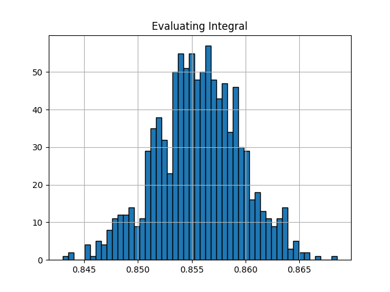

# Evaluating itegrals using Monte Carlo method (MC)
## Example
Evaluate the following using MC simulation

```math
    \int_0^1 e^{-\frac{x^2}{2}} dx
```

## Result
Value of integration (Sample Expection) = 0.8556222637805251

